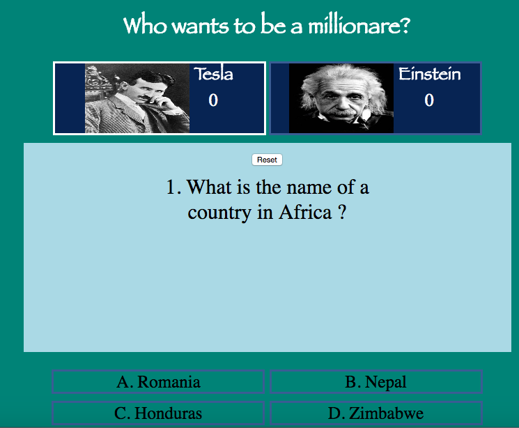
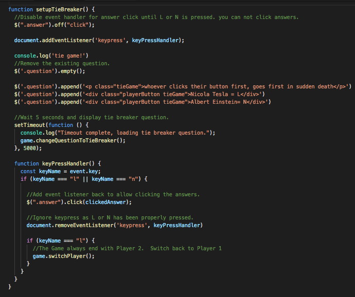
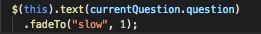
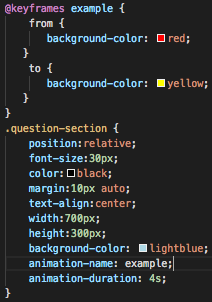

## Project #1: The Quiz Game
### Overview
 
A 2 Player-Game between Nicola Tesla and Albert Einstein

               Who wants to be a millionare?
              
              

 Screenshot:
---   

    
 Game logic:
---  
Two players will compete for 1 million dollars.  There are six standard questions. Each question has 4 answers.  In case of a tie, the game will show one final tie-breaker question.  If answered correct, the player wins.  If not, he loses.  Each correct answer is worth 100 points.

Game states:
---
   
  Players | status | Tie-case
--- | --- | ---
Tesla| win/lose | tie-->win/lose
Einstein | win/lose | tie-->win/lose

  
  Players | Correct Questions | Status
--- | --- | ---
Tesla/Einstein | 4+ correct answers | win
Tesla/Einstein| Less than 3 correct answers | lose
Tesla/Einstein| 3 correct answers | tie

Tiebreak:  
----
Add a tieBreaker function to break the tie.  

## **Logic**  
Notify players that they've tied 
Display tie breaker instructions with two keyNames for each player  
Nicola Tesla---> L  
Albert Einstein---> N  
Wait 5 seconds then display the tieBreaker question (setTimeout)  
Time to press the keys  
Press first---> answer first  
Answer correct--> win the Game  
Answer incorrect--> lose the Game  

Animation:  
---  
  

  
   

Tools:
---  
* HTML
* CSS
* Javascript
* JQuery
* Chrome Developer Console
* Visual Studio Code
* MacDown

Resources:
---  
* [MDN Javascript Docs](https://developer.mozilla.org/en-US/docs/Web/JavaScript)  
* [jQuery Docs](https://api.jquery.com/)

Approach:
---
I started by drawing the interface on paper followed by a logic flowchart.

Then:

1. Used symantic HTML to layout elements with CSS  
1. Wrote logic to display questions and answers  
1. Wrote logic to score correct answers and alert the winner.  
1. Introduced Reset button  
1. Introduced tie breaker challenge  
1. HTML / CSS / Javascript clean up  

Future Enhancements:
---
1. Change the number of Questions  
1. Change the number of Answers  
1. Randomize the Questions  
1. Change the tieBreaker function  
1. Change the style of the code 
1. Add countdown for each question 

Acknowledgements
---
#### Images
* [Tesla Photo](https://upload.wikimedia.org/wikipedia/commons/d/d4/N.Tesla.JPG)
* [Einstein Photo](https://images.gr-assets.com/authors/1429114964p5/9810.jpg)
* [Confetti Photo](https://bead109.files.wordpress.com/2017/07/giphy.gif)  

#### Audio
* [Applause](http://www.pacdv.com/sounds/people_sounds.html)
* [Sad Trombone Photo](https://www.myinstants.com/instant/sad-trombone/)

